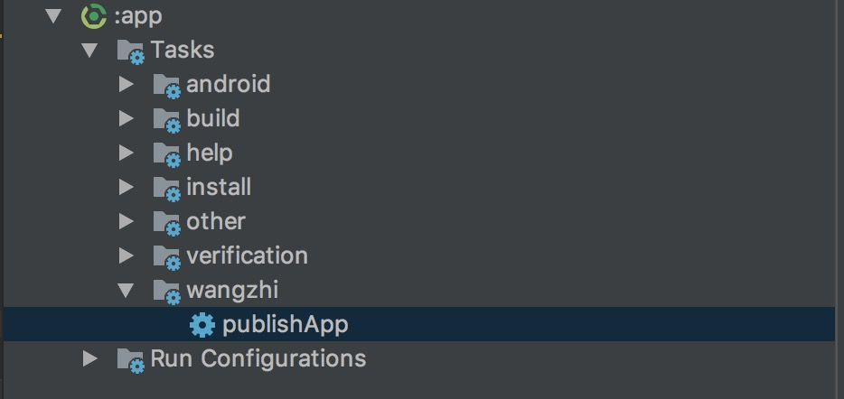

Gradle是Android使用的构建工具，了解它可以帮助我们理解Android项目的构建过程，实现我们在构建过程中的小需求。

本文以实现一个自动生成渠道包（打包，360加固，多渠道配置）的自定义插件为例，介绍一下Gradle的基础知识。

## 总览：

1. Groovy基础
1. Gradle执行流程
1. Project
1. Task
1. 实战（自定义Plugin）
1. 使用我们的插件

## 1：Groovy基础

Gradle的开发语言是Groovy，所以我们学习Gradle需要掌握Groovy，不过对于我们Android攻城狮来说这不是问题。为什么这么说呢：

1. 在Groovy中可以使用所有的Java类库；
1. Groovy最终也是编译为Java字节码执行在Java虚拟机上的；
1. Groovy对Java做了许多封装和扩展，以方便我们的使用；

所以在我们的开发过程中，我们可以使用Java代码实现我们的需求。不过为了不浪费Groovy为我们的封装、与源码更好的交互，我们还是了解一下比较好，下面我们来看一下它与Java有那些不一样的地方。

### 1.1：def关键字

见名知意，这个是用来定义的，可以用来定义变量和方法。

1. 定义变量时，表示这个变量是动态类型的，下面的代码完全没有问题。

    ```
    def value = 1
    value = "wangzhi"
    ````

1. def也可以用来定义方法，当方法指明返回值时，def关键字可以被省略。

### 1.2：String

Groovy中有两种String，String（java.lang.String）和GString（groovy.lang.GString），在Groovy中有三种不同的定义String的方式，我们使用最多的应该是第二种；

1. 单引号（java.lang.String）：

    ```
    def value = '我是一个字符串' 
    ```

1. 双引号：

    ```
    def value1 = "我支持使用表达式，$value，${1+1}" //groovy.lang.GString
    def value1 = "我是一个字符串" //java.lang.String
    ```

1. 三引号（java.lang.String）：

    ```
    def value2 = """我支持
    换
    行
    """
    ```

### 1.3：List

1. 定义：```def value = ["a", "b", "c"]```
1. 改：```value[0] = "e"```
1. 查：```value[0]```

Groovy默认会使用ArrayList，如果你想使用别的可直接使用Java中强类型的声明方式：

例如：```LinkedList value = [1, 2, 3]```

### 1.4：Map

1. 定义：```def value = ["a": 1, "b": 2, "c": 3]```
1. 增、改：```value.a = 100```或```value["a"] = 100```
1. 查：```value[a]```或```value.a```

这里默认会使用LinkedHashMap

### 1.5：Range

1. 定义：```def value = 1..100```
1. 使用：```if (1 in value)```

### 1.6：metaClass

在Groovy中可以在运行期间使用metaClass添加方法和属性，以下代码可以被正确执行。

```
    class A{
        String name
    }

    A.metaClass.getInfo = {
        println "getInfo"
    }
    A.metaClass.sex = 1

    def a = new A()
    a.name = "wangzhi"
    println a.name
    println a.sex
    a.getInfo()
```
在这里类A被添加上了getInfo方法和sex属性


### 1.7：闭包

闭包真的是Groovy中一个很重要的东西，闭包可能有一点像Java中的lambda表达式，不过闭包要强大许多；

#### 1. 闭包的定义：

```
def value = { String name ->
    println name
}
```

闭包的参数类型可以被省略，上面的代码可以修改为：

```
def value = { name ->
    println name
}
```

闭包只有一个参数时，这个参数可以被省略，我们可以直接使用```it```来访问这个参数，上面的代码可以修改为：

```
def value = {
    println it
}
```

#### 2. 闭包的使用：

以我们刚才定义的闭包为例：```value.call("wangzhi")```或```value("wangzhi")```

#### 3. 闭包的委托策略：

1. 闭包有三个相关对象:
    - this：闭包定义处最近的对象(不包含闭包)；
    - owner：闭包定义处最近的对象或闭包；
    - delegate：闭包的代理对象，默认和owner一致，可以手动设置；

    不太明白这三个对象的同学不用着急，后面我们用一个例子就可以很清楚的解释它们的作用。

2. 闭包的委托策略：
    - ```Closure.OWNER_FIRST```：默认策略，首先从owner上寻找属性或方法，找不到则在delegate上寻找。
    - ```Closure.DELEGATE_FIRST```：先在owner上寻找，后再delegate上寻找。
    - ```Closure.OWNER_ONLY```：只在owner上寻找
    - ```Closure.DELEGATE_ONLY```：只在delegate上寻找
    - ```Closure.TO_SELF```：高级选项，让开发者自定义策略

3. 举个例子：请看如下代码

    ```
    class A{
        String name
        def value = {
            println name
        }
    }

    def a = new A()
    a.name = "wangzhi"
    a.value.call()
    ```

    在这里闭包的三个对象都是A的实例对象，这个应该比较好理解，代码也没什么问题，可以正确输出，下面我们把代码改动一下

    ```
    class A{
        String name
        def value = {
            println age
        }
    }

    def a = new A()
    a.name = "wangzhi"
    a.value.call()
    ```

    在这里闭包的三个对象仍然是A的实例对象，不过这里代码就有问题了，因为A里没有age这个属性，这时候代理对象就可以派上用场了，我们再改动一下

    ```
    class A{
        String name
        def value = {
            println age
        }
    }
    class B{
        int age
    }

    def a = new A()
    a.name = "wangzhi"

    def b = new B()
    b.age = 18

    a.value.delegate = b
    a.value.call()
    ```

    在这里闭包的代理对象是B的实例对象b，按照默认的委托策略，当闭包在owner中找不到的时候，会在delegate中寻找，所以上面的代码可以正确的输出18

4. 在Groovy中当函数的最后一个参数是闭包时，调用时可以省略圆括号。

    ```
    buildscript {
        repositories {
            google()
            jcenter()
        }
        dependencies {
            classpath 'com.android.tools.build:gradle:3.1.4'
        }
    }
    ```

    是不是很熟悉，这里其实是调用了Project的buildscript方法，不过因为buildscript方法只有一个类型为闭包的参数，所以在这里圆括号是可以省略的，repositories、dependencies也是一样的道理，如果不省略应该像下面这么写

    ```
    buildscript({
        repositories({
            google()
            jcenter()
        })
        dependencies({
            classpath 'com.android.tools.build:gradle:3.1.4'
        })
    })
    ```

### 1.8：[了解更多](https://blog.csdn.net/singwhatiwanna/article/details/76084580)

## 2：Gradle执行流程

1. 初始化阶段：解析settings.gradle来获取模块信息
1. 配置阶段：配置每个模块，构建task树
1. 执行阶段：执行任务
1. [了解更多](https://blog.csdn.net/singwhatiwanna/article/details/78797506)

## 3：Project

在Gradle中，Project是树状的，每有一个build.gradle就有一个Project。1个根Project可以有1个或多个子Project，每个子Project也可以有1个或多个Project。

对应到Android中，我们的工程是一个根Project,我们的每一个module都是一个Project。

显而易见，Project是我们和Gradle构建脚本交互的核心，我们所有的逻辑也都直接或间接的写在了build.gradle中，下面我们来看一下Project的常用API。

### 3.1：Project相关API

1. ```getRootProject```：获取根Project
1. ```getAllprojects```：获取所有Project
1. ```getSubprojects```：获取所有子Project
1. ```allprojects```：遍历所有Project
1. ```subprojects```：遍历所有子Project

### 3.2：属性相关API

#### 1. ```hasProperty```：检查属性是否存在
#### 2. ```findProperty```：查找属性
#### 3. 自定义Property：

1. 通过命令行参数定义Property：```gradle build -P a=1```
1. 通过project.ext定义参数：

    ```
    ext.a = 1

    ext{
        a = 1
    }
    ```

    这个ext是哪里来的呢，这个是因为Project实现了```ExtensionAware```接口，```ExtensionAware```接口有一个```ExtensionContainer```，```ExtensionContainer```中有一个```ExtraPropertiesExtension```，有兴趣的同学可以跟着看一下，在```ExtraPropertiesExtension```中我们就可以找到这个ext了，通过它的默认实现我们还可以发现在ext中定义的属性是放在一个```Map<String, Object>```里的

### 3.3：Task相关API

1. ```getTasks```：获取当前Project所有Task
1. ```task```：创建一个Task

### 3.4：文件相关API

1. ```file```：获取文件
1. ```fileTree```：获取文件夹
1. ```getBuildDir```：获取build文件夹

### 3.5：Gradle生命周期API
1. ```beforeEvaluate```：配置阶段开始之前
1. ```afterEvaluate```：配置阶段结束
    
    这是一个比较重要的生命周期，当走到这里时说明所有的task都已经配置完成了，我们可以对其进行操作，加入我们的逻辑，也可以插入我们的自定义task。

1. ```gradle.buildFinished```：执行阶段结束

### 3.6：其它API

1. ```exec```：执行外部命令，我们后面会用到这个方法

## 4：Task

Task是Gradle另外一个很重要的东西，下面我们来看一下Task的基础内容。

### 4.1：Task定义

1. 我们可以通过我们Project中的task方法来定义一个Task

    ```
    task myTask{
       println "myTask" 
    }
    这里是调用了task方法，因为最后一个参数是闭包，所以这里可以省略圆括号
    ```

1. 我们也可以使用Project中的TaskContainer来定义一个Task

    ```
    project.tasks.create(name: "myTask") {
        println "myTask"
    }
    这里的tasks就是一个TaskContainer
    ```

### 4.2：Task基础信息的配置

我们可以为我们的Task配置相关信息，配置的方法也有很多，下面我们看一下其中的两种方法；

1. 在创建Task的同时进行配置；

    ```
    task myTask(
        group: "wangzhi", 
        description: "is a task", 
        dependsOn: "build"){
       println "myTask" 
    }
    ```

1. 在Task中调用对应的配置方法进行配置；

    ```
    task myTask {
        group "wangzhi"
        description "is a task"
        dependsOn "build"
        println "myTask" 
    }
    ```

### 4.3：Task依赖

Task可以调用dependsOn方法配置他依赖的Task，可以是一个也可以是多个。

```
task A {
}
task B {
    dependsOn A
}
```

以上面的代码为例，当我们要执行Task B时，会先执行Task A，因为我们的Task B是依赖Task A的。

### 4.4：Task执行

写在我们Task闭包内的代码是执行在Gradle的配置阶段的，执行每一个任务时都会执行一遍，如果想执行在执行阶段，需要将代码写在```doFirst```或```doLast```中。

```
task myTask {
    println "1"
    doFirst {
        println "2"
    }
    doLast {
        println "3"
    }
}
```

在上面的代码中，1会在配置阶段输出，2、3会在执行阶段先后输出，这里的```doFirst```和```doLast```都可以写多个。

为什么要分开```doFirst```和```doLast```呢，为什么不是一个```do```呢，因为在我们想为已有的Task加入我们的逻辑的时候，我们有可能想在Task执行之前加，也有可能需要在Task执行之后添加，这时候这两个就都派上用场了。

```mustRunAfter```方法：这个方法可以指定Task必须执行在一个或多个Task后面，和```dependsOn```是有区别的。

举个例子：我们有两个Task A、B；

1. A ``` mustRunAfter ``` B ：如果A、B一起执行，A在B之后执行，但是如果只执行A，B不会被执行。
1. A ``` dependsOn ``` B ：就算只执行A，B也会被执行，因为A是依赖B的。

## 5：实战（自定义Plugin）

下面我们一步步实现我们的需求，我们的需求是自动生成渠道包（打包，360加固，多渠道配置）；

其实有了上面的知识，我们已经可以实现我们的小需求了。但是只能应用在当前项目中，如果其它项目也需要用，我们还需要把我们的代码粘贴到另一个项目的build.gradle中，这简直太麻烦了，后续维护成本也会增加。

这个时候我们可以把我们的代码封装为一个插件，让其它项目或者其它人能够更方便的使用。自定义插件的方法也有很多，这里我们以新建一个工程的方式，去完成我们的需求，

#### 1. 创建工程：

1. 使用AndroidStudio新建一个工程即可，
1. 在```src/main```下新建两个文件夹，```groovy、resources```,

    PS：这里的名字其实叫什么都可以，之前的```java、res```我们可以直接删除。
1. 修改```app文件夹下的build.gradle```文件

    ```
    apply plugin: 'groovy'//使用groovy插件
    dependencies {
        implementation gradleApi()//引入gradleApi
    }
    sourceSets {
        main {
            groovy {
                srcDir 'src/main/groovy'//指定groovy目录
            }
            resources {
                srcDir 'src/main/resources'//指定resources目录
            }
        }
    }
    ```

1. 在```groovy```目录中新建```PublishAppPlugin.groovy```文件,实现```Plugin```接口

    ```
    class PublishAppPlugin implements Plugin<Project> {
        @Override
        void apply(Project project) {//入口
            println "hello plugin"
        }
    }
    ```

1. 在```resources/META-INF/gradle-plugins```目录中新建```com.wangzhi.plugin.publishApp.properties```文件，这个文件名就是别人要使用我们插件时要```apply```的名字，我这里是```com.wangzhi.plugin.publishApp```，在这个文件中写入以下代码：

    ```
    implementation-class=com.wangzhi.plugin.publishApp.PublishAppPlugin
    //后面的值就是我们上一步新建的文件路径，这里的路径是没有限制的
    ```

1. 最后我们的目录变成了这样


#### 2. 接收必要参数

1. 根据我们的需求，我们需要以下参数。
    - 360加固包的路径
    - 签名文件的路径、密码信息
    - 渠道文件的路径
    - 文件输出路径
1. 定义扩展信息，新建```PublishAppInfoExtension.groovy```文件，根据上面的信息，定义相关参数

    ```
    class PublishAppInfoExtension {
        String qihuPath //360加固包（jiagu.jar）的文件路径
        String keyStorePath //keyStor文件路径
        String keyStorePass //keyStor密码
        String keyStoreKeyAlias //keyStoreKeyAlias
        String keyStoreKeyAliasPass //keyStoreKeyAlias密码
        String channelPath //渠道文件路径
        String outputPath //文件夹输出路径
    }
    ```
1. 为目标工程定义扩展：

    ```
    class PublishAppPlugin implements Plugin<Project> {
        @Override
        void apply(Project project) {
            project.extensions.create("publishAppInfo", PublishAppInfoExtension.class)
        }
    }
    ```

#### 3. 功能实现：

##### 1. 自定义Task

1. 新建```PublishAppTask```继承```DefaultTask```

    ```
    class PublishAppTask extends DefaultTask{
        PublishAppTask() {
            group = "wangzhi"
            dependsOn "build"
        }
        @TaskAction
        void doAction(){
            //打包已完成
        }
    }
    ```
1. 为目标工程定义我们的Task

    ```
    class PublishAppPlugin implements Plugin<Project> {
        @Override
        void apply(Project project) {
            project.extensions.create("publishAppInfo", PublishAppInfoExtension)
            project.tasks.create("publishApp", PublishAppTask.class)
        }
    }
    ```

1. ```@TaskAction```是任务执行的方法，会在执行阶段执行，因为我们的任务是依赖于```build```的，所以当我们的任务执行时，打包已经完成了。
    
##### 2. 加固我们的应用

这里参考360加固的命令行加固相关文档即可，下面我们来看一下代码。

```
class PublishAppTask extends DefaultTask {

    PublishAppTask() {
        group = "wangzhi"
        dependsOn "build"
    }

    @TaskAction
    void doAction() {
        //打包已完成

        //这里的路径其实是不严谨的·
        def oldApkPath = "${project.getBuildDir()}/outputs/apk/release/app-release.apk"

        //获取参数
        def qihuPath = project.extensions.publishAppInfo.qihuPath
        def keyStorePath = project.extensions.publishAppInfo.keyStorePath
        def keyStorePass = project.extensions.publishAppInfo.keyStorePass
        def keyStoreKeyAlias = project.extensions.publishAppInfo.keyStoreKeyAlias
        def keyStoreKeyAliasPass = project.extensions.publishAppInfo.keyStoreKeyAliasPass
        def apkOutputDir = project.extensions.publishAppInfo.outputPath
        //360加固-登录
        execCmd("java -jar ${qihuPath} -login userName pass")
        //360加固-签名信息配置
        execCmd("java -jar ${qihuPath}  -importsign ${keyStorePath} ${keyStorePass} ${keyStoreKeyAlias} ${keyStoreKeyAliasPass}")
        //360加固-渠道信息配置
        execCmd("java -jar ${qihuPath} -importmulpkg ${project.extensions.publishAppInfo.channelPath}")
        //360加固-开始加固
        execCmd("java -jar ${qihuPath} -jiagu ${oldApkPath} ${apkOutputDir} -autosign  -automulpkg")
        println "加固完成"
    }

    void execCmd(cmd) {
        project.exec {
            executable 'bash'
            args '-c', cmd
        }
    }
}
```

#### 4.发布我们的插件

##### 1. 发布到本地maven

1. 添加如下代码

    ```
    apply plugin: 'maven'
    uploadArchives {
        repositories.mavenDeployer {
            repository(url: 'file:///Users/wangzhi/Documents/localMaven')
            pom.groupId = "com.wangzhi.plugin"
            pom.artifactId = "publishApp"
            pom.version = "1.0.0"
        }
    }
    ```

2. 执行发布任务


##### 2. 发布到[Gradle Plugins](https://plugins.gradle.org/)

直到现在我发布的插件还是审核中的状态，所以这里就不具体介绍了，有兴趣的同学可以看一下[相关文档](https://plugins.gradle.org/docs/submit)

## 6：使用我们的插件

### 1. 在目标工程修改跟根目录下```build.gradle```中的```buildscript```

1. ```repositories```增加我们的本地maven地址

    ```
    maven {
        url 'file:///Users/wangzhi/Documents/localMaven'
    }
    ```

1. ```dependencies```增加我们的插件

    ```
    classpath 'com.wangzhi.plugin:publishApp:1.0.0'
    ```

### 2. 修改```app```目录下的```build.gradle```

1. 引入我们的插件
    
    ```
    apply plugin: 'com.wangzhi.plugin.publishApp'
    ```

2. 增加配置信息

    ```
    publishAppInfo {
        qihuPath = ""
        keyStorePath = ""
        keyStorePass = ""
        keyStoreKeyAlias = ""
        keyStoreKeyAliasPass = ""
        channelPath = ""
        outputPath = ""
    }
    ```
3. 执行```publishApp```任务


    
希望此文能够让大家了解Gradle的基础知识，在实现相关需求的时候可以多一些思路。
